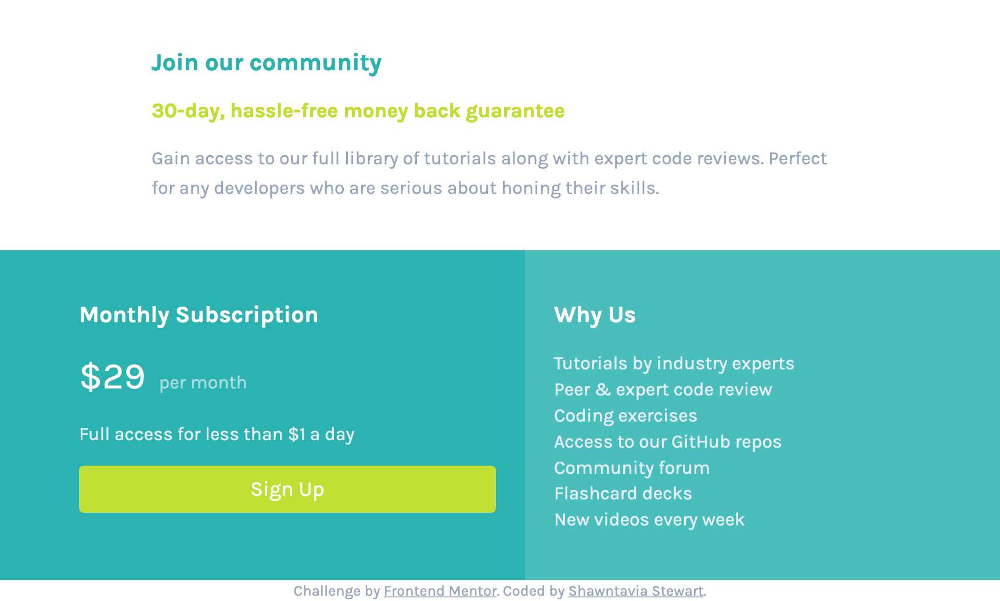
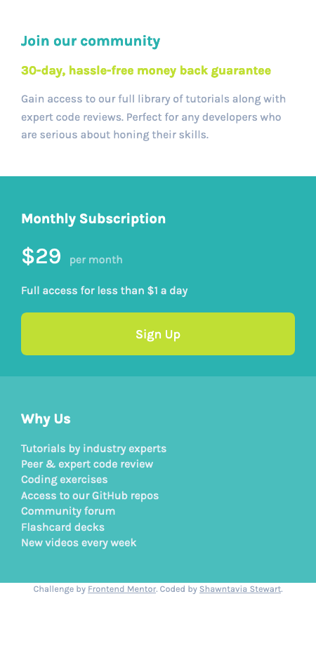

# Frontend Mentor - Single price grid component solution


## Table of contents

- [Overview](#overview)
  - [The challenge](#the-challenge)
  - [Screenshot](#screenshot)
  - [Links](#links)
- [My process](#my-process)
  - [Built with](#built-with)
  - [What I learned](#what-i-learned)
  - [Continued development](#continued-development)
  - [Useful resources](#useful-resources)
- [Author](#author)
- [Acknowledgments](#acknowledgments)


## Overview

### The challenge

Users should be able to:

- View the optimal layout for the component depending on their device's screen size
- See a hover state on desktop for the Sign Up call-to-action

### Screenshot





### Links

- Solution URL: https://github.com/shawntavia/FM-Single-price-grid-challenge
- Live Site URL: https://shawntavia.github.io/FM-Single-price-grid-challenge/

## My process

I wanted to start with mobile first then once that was complete, add media queries for desktop. I would have liked to add one for tablet as well, but that was not requested. I wanted to have a nice skeleton first before adding styles. Then i wourked on overall styles (background colors and headers) before smaller things (span).

### Built with

- Semantic HTML5 markup
- CSS custom properties
- Flexbox
- Mobile-first workflow


### What I learned

This is my first project where I didn't have a walk-through. It was small, but I think I learned a lot about how to structure a document so I can move things using flexbox later. I really enjoyed the hover effect of the sign-up button. I had never created a button that had effects and I was proud about researching and seeing what would work. Originally, I had my button doing obnoxious things just because before a toned it down. Later I will work on making this more of a link. I realized later down in the project that this “button” should have been more of a link to take you to a sign-up sheet, but again, I'm happy that I have some hover effects.

To see how you can add code snippets, see below:

```html
<h1>Some HTML code I'm proud of</h1>
 <div class="container">
  <section class="sub">
    <div class="content-wrapper">
      <h2>Monthly Subscription</h1>

        <p><span class="price">&dollar;29</span> <span class="month">
          &nbsp per month</span> </p>

        <p>Full access for less than &dollar;1 a day</p>
      <div class="sign up"> 
         <button class="button">Sign Up</button>
```
```css
.proud-of-this-css {
  color: papayawhip;
  .button {
    background-color: hsl(71, 73%, 54%);
    border: none;
    border-radius: 8px;
    color: white;
    cursor: pointer;
    font-weight: 500;
    font-size: 1.125em;
    padding: 20px 0;
    margin-top: 20px;
    width: 100%;
    display: flex;
    justify-content: center;
  }
  button:hover {    
    background-color: hsla(71, 73%, 54%, 0.938);
    font-size: 1.12em;
  }
}
```
```js

```

If you want more help with writing markdown, we'd recommend checking out [The Markdown Guide](https://www.markdownguide.org/) to learn more.


### Continued development

I only have knowledge of flexbox. I would like to see how this would work with grid or scss in the future. I will be started javaScript later this month so I'll have room to expand and do larger, more complex projects.


### Useful resources

- https://www.sliderrevolution.com/resources/css-button-hover-effects/ - This helped me for buttons. I really liked this and will use it going forward, especially once i start using javaScript.
- https://www.skillcrush.com - Great resource for becoming a front-end developer.


## Author

- Frontend Mentor - [@yourusername](https://www.frontendmentor.io/profile/shawntavia)
- GitHub - [@shawntavia](https://www.github.com/shawntavia)


## Acknowledgments

I would not have been able to do this without first taking 101 and 206 courses at Skillcrush. The program and the projects provided have prepared me well to do this challenge own my own. One of my mentor's Lisa helped me discover Frontend mentor.


